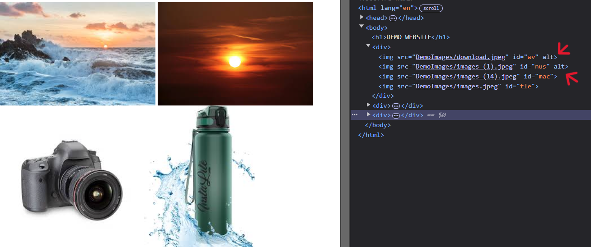
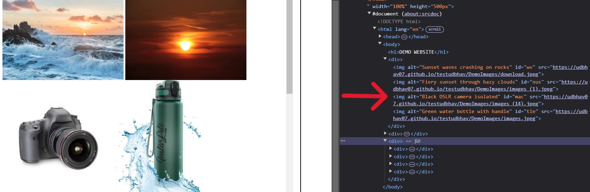
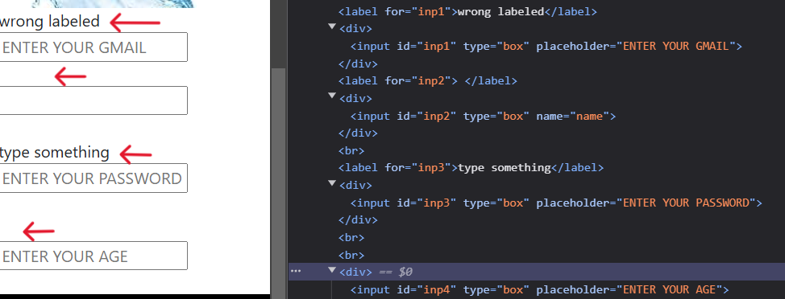
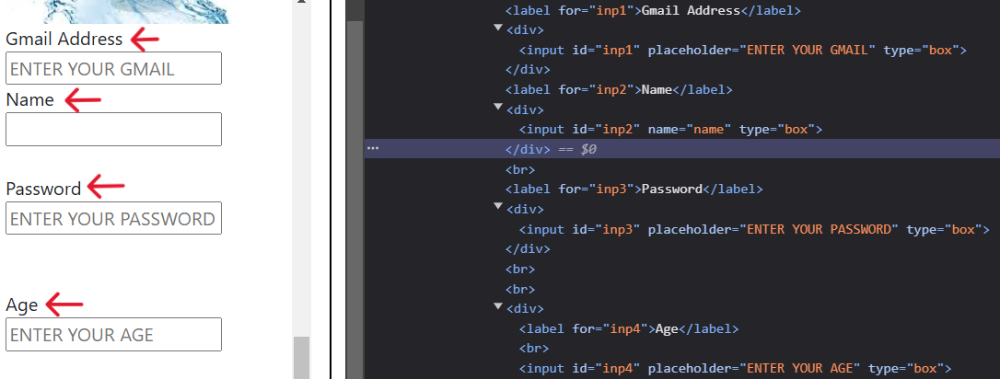
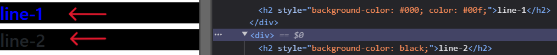
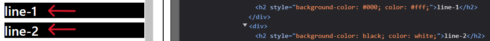

# AccessAI-AG33

AccessAI takes a web page URL, fixes common accessibility problems, and verifies the fixes by rendering the original and repaired pages side by side in a headless browser.

## What it fixes

| Problem | Fix |
|---|---|
| Images with no `alt` | Gemini writes a short description. If it can't, the image is left unchanged. |
| Form fields without a proper label | Adds a `<label>` (fields with an `id`) or an `aria-label`. Existing good labels are kept. |
| Text below WCAG AA contrast (4.5:1, or 3:1 for large text) | Renders the page in Chromium, measures the real text and background colour of every element, and sets a passing colour on each failing one. |

Model suggestions are only used if they pass the contrast check; otherwise a deterministic colour is used. Passing text inside a fixed element keeps its colour. Text over images or gradients is skipped and reported.

## Verification

**Verify fixes** renders both versions in Chromium and compares every element:

| Check | Tier | Fails when |
|---|---|---|
| Layout | blocking | an element changed width or height |
| Visibility | blocking | a visible element disappeared |
| Colour | blocking | an element that wasn't fixed changed colour |
| Contrast | objective | a fixed colour still fails, or contrast got worse |
| Coverage | objective | fewer images/inputs are covered than before |
| Remaining | advisory | text is still below the threshold |
| Pixels | advisory | pixels changed outside the fixed elements |

Verdict: any blocking failure → **BROKEN**, else objective → **INCOMPLETE**, else advisory → **REVIEW**, else **PASS**. **ERROR** means the page couldn't be rendered.

## Project structure

```
backend/                Flask JSON API
  accessai/api/         routes, error handling, rate limit
  accessai/core/        scraper, fixers, Gemini client, browser rendering, verifier
  accessai/config.py    all settings (see .env.example)
  tests/                pytest suite and HTML fixtures
  wsgi.py               entry point
frontend/               React + TypeScript + Vite
  src/api/              API client and types
  src/hooks/            useScan, useAppConfig
  src/components/
render.yaml             Render deployment (API + static site)
```

## Running locally

Requires Python 3.12+ and Node 20.19+.

**Backend** (http://localhost:8000):

```bash
cd backend
python -m venv .venv
source .venv/bin/activate          # Windows: .venv\Scripts\activate
pip install -r requirements.lock
python -m playwright install chromium
cp .env.example .env               # add GEMINI_API_KEY
python wsgi.py
```

**Frontend** (http://localhost:5173, proxies `/api` to the backend):

```bash
cd frontend
npm install
npm run dev
```

Without a [Gemini API key](https://aistudio.google.com/apikey) the app still runs, but alt text and labels are skipped and colours use the deterministic fallback. Without the Playwright browser, contrast isn't checked and verification returns ERROR.

Test pages with known problems: [experiment.html](https://udbhav07.github.io/testudbhav/experiment.html), [demo_all_sources.html](https://udbhav07.github.io/testudbhav/demo_all_sources.html).

## API

| Method | Path | Description |
|---|---|---|
| GET | `/api/health` | `storage`, `browser` and `ai` checks; 503 if storage or the browser fails |
| GET | `/api/config` | `ai_enabled`, `scans_per_hour`, `result_ttl_minutes` |
| POST | `/api/scans` | `{"url": "..."}` → scan result (201) |
| GET | `/api/scans/<id>` | stored scan result |
| POST | `/api/scans/<id>/verification` | runs the checks → `{"report": ...}` |
| GET | `/api/scans/<id>/download` | fixed page as HTML (`?stamped=1` keeps `data-aai-*` ids) |

Errors are `{"error": {"code": "...", "message": "..."}}` with status 400, 404, 422, 429, 500 or 502. Results are kept for one hour (less on Render's free plan, which clears them on restart).

## Tests

```bash
cd backend
pip install -r requirements-dev.txt
python -m pytest

cd ../frontend
npm test && npm run lint && npm run typecheck
```

No API key or network needed. The verifier tests use a real headless browser.

## Deployment

`render.yaml` creates two Render services: `accessai-api` and `accessai` (static site). After the first deploy:

1. Set `CORS_ORIGINS` on the API to the frontend URL.
2. Set `VITE_API_BASE_URL` on the frontend to the API URL and redeploy it.
3. Set `GEMINI_API_KEY` on the API.

All outbound requests are blocked from private and local addresses. Never set `ACCESSAI_ALLOW_PRIVATE_HOSTS` in production.

## Limitations

- Pages are read without running JavaScript, so single-page apps (React, Vue, ...) show little content.
- Sites that block bots or require login can't be scanned.
- Only `` alt text and `<input>`/`<select>`/`<textarea>` labels are handled. Images marked decorative (`alt=""`, `role="presentation"`) are left alone.
- Contrast is not measured for text on background images or gradients, or for hover and `:visited` states.

## Contact

- [udbhavsai.k@gmail.com](mailto:udbhavsai.k@gmail.com)
- [b.abhi2790@gmail.com](mailto:b.abhi2790@gmail.com)

## Screenshots

**Alt text**
 

**Labels**
 

**Contrast**
 
